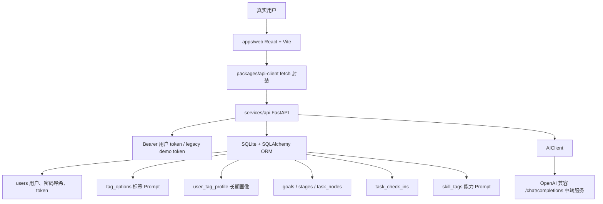

# LeavesFlow V1.3 产品开发与维护文档

版本日期：2026-05-17
适用分支：`v1`
适用范围：LeavesFlow V1.3 Web + API 当前实现
文档状态：V1.3 当前产品与代码基线说明。文件名保留 `v1.2` 是为了兼容已有引用，正文以 V1.3 为准。

本文面向第一次接触 LeavesFlow 的开发者。读完后，应能理解当前产品闭环、用户注册体系、数据持久化、AI 中转调用方式、前端页面结构、接口合同、测试方式和后续迭代边界。

## 1. 产品定位

LeavesFlow 是一个面向 Vibe Coding / AI coding agent 场景的任务导航产品。

它不是传统 ToDo List，也不是展示型 Demo。它的核心是把用户的真实目标、长期画像、任务偏好和标签背后的 Prompt 上下文，转化为可执行、可打卡、可持续沉淀能力资产的任务路径。

当前产品闭环是：

```text
注册或登录真实用户
-> 首次注册时选择唯一画像标签：身份、专业背景、能力阶段
-> 输入目标，并选择本次任务偏好标签
-> 后端注入隐藏 Prompt 与标签上下文
-> 调用真实 OpenAI 兼容 AI 中转服务
-> 生成树状任务导航
-> 路径生成中展示 V1.1 风格生成动画
-> 用户按节点打卡
-> AI 提炼能力 Prompt
-> 回写技能资产库
-> 未完成路径持久化恢复
-> 用户页小卡片查看路径历史
-> 点开历史详情回看完整路径与打卡内容
-> 全部任务完成后目标归档为 completed
```

### 1.1 V1.2 相比 V1.1 的重点变化

V1.2 的重点是从 MVP / Demo 流程推进到真实产品闭环：

- 新增注册和登录，不再要求前端依赖虚拟用户。
- 注册用户、密码哈希、访问 token、用户资料、画像标签、目标、路径、打卡和技能资产全部持久化到 SQLite。
- `identity_tags`、`background_tags`、`level_tags` 变为注册后用户画像的唯一选择，不再在每次任务设计时重复选择。
- `goal_type_tags`、`time_range_tags`、`output_preference_tags` 与目标输入页合并，作为每次目标生成时的任务偏好。
- 目标输入不再预置示例问题，改为浅色 placeholder 进行友好引导。
- 删除单独“标签”底部导航；当前底部导航为 `目标`、`路径`、`技能`、`用户`。
- 新增用户页，用于查看账号信息、编辑展示名称、维护长期画像和退出登录。
- 路径页新增未完成任务恢复：刷新页面或重新登录后，如果当前用户有未完成路径，直接展示该路径。
- 目标所有任务打卡完成后，后端自动将目标状态更新为 `completed`，该目标不再作为活跃路径恢复。
- 运行时移除 Mock AI 兜底。没有真实 AI 配置时直接返回 `AI_NOT_CONFIGURED`。
- AI 结果校验更严格：推荐工具和资源必须是真实 `http/https` URL，禁止 `example.com` 占位链接。
- 目标路径生成过程中展示生成动画；未生成或生成完成时展示普通路径导航或空状态。

### 1.2 V1.3 相比 V1.2 的重点变化

V1.3 继续围绕真实用户闭环演进，这一版的重点是把“历史路径回看”补进用户页，让路径不只是能执行、能打卡，也能被持续回看和复盘：

- 用户页原来的“编辑信息”区域替换为路径历史查看区。
- 历史路径以小卡片形式展示，默认按目标标题、完成状态和进度进行快速浏览。
- 用户可以点开任意历史小卡片，查看该目标对应的完整路径详情。
- 历史详情会回显每个节点在打卡时用户自己填写的 `whatDone`、`whatProduced`、`problems`。
- `GET /me` 现在会返回 `goalHistory`，供用户页直接渲染历史小卡片。
- `GET /goals/{goalId}` 和 `GET /goals/{goalId}/plan` 的任务节点会回传 `checkIn`，便于历史详情直接展开。
- 路径历史当前不分页，默认展示当前用户的全部历史目标。
- 用户页仍保留长期画像维护和退出登录；展示名称编辑入口在 V1.3 前端页面中不再单独展示。

## 2. 产品原则

### 2.1 真实产品原则

- 当前版本按商业产品标准维护，不允许把 Mock 内容作为用户可见运行时兜底。
- 前端可以有友好空状态和输入引导，但不能伪造任务路径、技能资产或推荐资源。
- 后端在 AI 不可用、配置缺失、返回格式不合规时必须显式失败，让问题可观测、可定位。
- 测试可以 monkeypatch AIClient 使用测试 fixture，但测试 fixture 不能成为运行时代码路径。

### 2.2 用户与画像原则

- 用户通过 `POST /auth/register` 注册，通过 `POST /auth/login` 登录。
- 密码使用 PBKDF2 哈希保存，不保存明文密码。
- 前端将登录 token 存入 `localStorage`，API client 用 Bearer Token 调用受保护接口。
- 注册时必须选择：
  - 身份标签 `identity_tags`
  - 专业背景 `background_tags`
  - 能力阶段 `level_tags`
- 这些长期画像标签只保存 tag option id，不保存中文 label。
- 用户后续可以在用户页修改展示名称和长期画像。

### 2.3 目标输入原则

- `rawInput` 技术上限为 1000 字。
- 目标输入页不再预填示例目标。
- placeholder 应使用轻量友好的引导，不应替用户预设问题。
- 当目标较短时，AI 应结合用户画像和任务偏好 Prompt 补足上下文，而不是抱怨信息不足。

### 2.4 标签原则

标签不是几个字，而是“短标签 + 背后封装 Prompt”。

长期画像标签：

- `identity_tags`
- `background_tags`
- `level_tags`

任务偏好标签：

- `goal_type_tags`
- `time_range_tags`
- `output_preference_tags`

前端展示：

- 默认展示标签 `label`。
- 用户可展开查看 `promptText`。
- 当前版本不允许用户编辑标签 Prompt。
- 每个类别当前为单选体验。

后端存储：

- 标签选项存储在 `tag_options` 表。
- 用户画像保存 tag option id 数组。
- 目标创建时将长期画像和本次任务偏好合并为 `profile_snapshot`。
- AI 调用时注入标签背后的 `prompt_text`。

### 2.5 任务拆解原则

任务节点必须适合交给 AI 编程工具或 AI 协作工具执行。

每个节点应满足：

- 边界小。
- 输入清楚。
- 动作明确。
- 产出可检查。
- 完成标准明确。
- 至少包含一个真实推荐工具。
- 至少包含一个真实推荐资源。
- 推荐链接不能使用 `example.com` 或无效 URL。

### 2.6 能力资产原则

“技能”页不是普通标签云，而是能力 Prompt 资产库。

每个能力资产包含：

- `name`：短名称。
- `level`：入门、进阶、熟练。
- `prompt`：可复用、可直接交给 AI 使用的能力 Prompt。
- `evidence`：来源说明。
- `count`：积累次数。

## 3. 技术架构总览



### 3.1 技术选型

前端：

- React 18
- Vite 5
- TypeScript
- Tailwind CSS
- lucide-react
- 不使用大型 UI 组件库
- 基础 PWA manifest/meta，不做 service worker 离线缓存

后端：

- Python 3.11+
- FastAPI
- SQLAlchemy 2.x ORM
- SQLite
- Pydantic/FastAPI 作为 OpenAPI 源
- 当前仍未引入 Alembic，启动时自动建表并执行轻量字段迁移

Monorepo：

- npm workspaces
- `packages/shared-types` 存放前端共享类型
- `packages/api-client` 存放手写 fetch 薄封装

## 4. 仓库结构

```text
apps/
  web/                         React Web PWA
    src/App.tsx                V1.3 主要前端页面和组件
    src/api.ts                 初始化 API client 与 token 持久化
    src/styles.css             Tailwind 入口和生成动画样式
    vite.config.ts             Vite 配置，固定 5173
  mobile/
    README.md                  React Native 预留占位

packages/
  shared-types/
    src/index.ts               前端 TypeScript 类型
  api-client/
    src/index.ts               fetch client、鉴权、错误封装

services/
  api/
    scripts/export_openapi.py  导出 OpenAPI JSON 到 docs/openapi.yaml
    src/leavesflow_api/
      main.py                  FastAPI app 和路由
      ai.py                    真实 AI 调用、JSON 解析、schema 校验
      prompts.py               系统 Prompt
      services.py              业务服务和 DB 转换
      schemas.py               Pydantic schema
      models.py                SQLAlchemy model
      default_tags.py          默认标签 Prompt
      config.py                配置加载
      auth.py                  Bearer token 鉴权
      bootstrap.py             建表、默认数据、轻量迁移
    tests/test_smoke.py        后端闭环 smoke test

config/
  config.example.json          示例配置，可提交
  config.json                  本地真实配置，不提交

docs/
  implementation-decisions.md
  openapi.yaml                 OpenAPI 导出文件
  leavesflow-v1.1-product-development-guide.md

scripts/
  run_api_dev.ps1
  run_api_dev.cmd
  bugfix_ui_check.py
  web_smoke_test.py
  v11_ui_check.py
```

## 5. 本地运行

### 5.1 配置文件

复制配置样例：

```powershell
Copy-Item config/config.example.json config/config.json
```

`config/config.json` 不应提交。真实 API key、真实中转站地址、服务器信息、数据库和日志都属于敏感内容。

关键配置结构：

```json
{
  "app": {
    "env": "dev",
    "demo_bearer_token": "dev-demo-token",
    "demo_user_id": "7d4c8b54-9797-4e70-96fa-2d8c2d3d4a10"
  },
  "database": {
    "url": "sqlite:///./data/leavesflow.db"
  },
  "openai_compatible": {
    "base_url": "https://your-openai-compatible-relay/v1",
    "api_key": "",
    "chat_model": "gpt-4o-mini",
    "timeout_seconds": 120,
    "max_retries": 2
  },
  "cors": {
    "allow_origins": [
      "http://localhost:5173",
      "http://127.0.0.1:5173",
      "https://leavesflow.syt.huickathon.cn"
    ]
  }
}
```

AI 配置规则：

```text
openai_compatible.base_url 非空
openai_compatible.api_key 非空
=> 调用真实 OpenAI 兼容中转服务

base_url 或 api_key 缺失
=> 运行时生成路径或提炼技能返回 AI_NOT_CONFIGURED
```

当前版本不再有运行时 Mock AI 兜底。

### 5.2 后端启动

推荐方式：

```powershell
$env:PYTHONPATH='services/api/src'
python -m uvicorn leavesflow_api.main:app --host 127.0.0.1 --port 8000
```

或：

```powershell
powershell -NoProfile -ExecutionPolicy Bypass -File scripts/run_api_dev.ps1
```

健康检查：

```text
http://localhost:8000/api/v1/health
```

期望返回：

```json
{"status":"ok"}
```

### 5.3 前端启动

```powershell
npm install
npm run dev:web
```

打开：

```text
http://localhost:5173
```

前端固定使用 `5173`。不要改用 `5174` 作为主调试端口。若端口被占用，先结束占用进程再重启。

检查端口：

```powershell
netstat -ano | Select-String ':5173|:8000'
```

## 6. 数据模型

当前使用 SQLite + SQLAlchemy 2.x ORM。模型定义在 `services/api/src/leavesflow_api/models.py`。

### 6.1 users

真实用户表。

字段：

- `id`
- `username`
- `display_name`
- `password_hash`
- `auth_token`
- `created_at`
- `updated_at`

约束：

```text
username 唯一
```

说明：

- `username` 归一化为小写。
- `password_hash` 使用 `pbkdf2_sha256$salt$digest` 格式。
- `auth_token` 登录时刷新。
- legacy demo 用户仍可由 `demo_user_id` 初始化，用于兼容旧开发脚本，不应作为产品主路径。

### 6.2 tag_options

标签选项表，是 Prompt 注入的基础。

字段：

- `id`
- `category`
- `label`
- `prompt_text`
- `sort_order`
- `enabled`
- `created_at`
- `updated_at`

唯一约束：

```text
category + label
```

标签类别：

```text
identity_tags
background_tags
level_tags
goal_type_tags
time_range_tags
output_preference_tags
```

默认标签由 `services/api/src/leavesflow_api/default_tags.py` 初始化。

### 6.3 user_tag_profile

用户标签画像表。

字段：

- `user_id`
- `identity_tag_ids`
- `background_tag_ids`
- `level_tag_ids`
- `goal_type_tag_ids`
- `time_range_tag_ids`
- `output_preference_tag_ids`
- `updated_at`

V1.3 行为：

- 注册和用户页只维护长期画像字段：`identity_tag_ids`、`background_tag_ids`、`level_tag_ids`。
- 目标页选择的任务偏好会在创建目标时进入 `profile_snapshot`，不会覆盖长期画像。
- 字段实际存储为 JSON string。
- schema 仍使用 list，为后续多选预留。

### 6.4 goals

目标表。

字段：

- `id`
- `user_id`
- `title`
- `raw_input`
- `profile_snapshot`
- `status`
- `goal_summary`
- `created_at`
- `updated_at`

关键逻辑：

- `raw_input` 保存用户原始目标。
- `profile_snapshot` 保存创建目标时的长期画像和任务偏好 id 快照。
- `status` 为 `active` 或 `completed`。
- 所有任务节点完成后，`mark_goal_completed_if_needed(...)` 将目标改为 `completed`。

### 6.5 stages

任务路径阶段表。

字段：

- `id`
- `goal_id`
- `title`
- `description`
- `sort_order`

### 6.6 task_nodes

任务节点表，是 AI 拆解结果的核心。

字段：

- `id`
- `goal_id`
- `stage_id`
- `title`
- `description`
- `context_for_ai`
- `vibe_coding_prompt`
- `expected_output`
- `path_steps`
- `tools`
- `resources`
- `completion_criteria`
- `predicted_skill_tags`
- `status`
- `sort_order`

其中 JSON string 字段：

- `path_steps`
- `tools`
- `resources`
- `completion_criteria`
- `predicted_skill_tags`

### 6.7 task_check_ins

用户打卡表，也是历史路径回放时节点级文本内容的唯一来源。

字段：

- `id`
- `user_id`
- `task_node_id`
- `goal_id`
- `what_done`
- `what_produced`
- `problems`
- `created_at`

唯一约束：

```text
task_node_id
```

当前每个任务节点只能打卡一次。

### 6.8 skill_tags

能力 Prompt 资产表。

字段：

- `id`
- `user_id`
- `name`
- `level`
- `skill_prompt`
- `source_task_id`
- `source_goal_id`
- `evidence`
- `count`
- `created_at`
- `updated_at`

唯一约束：

```text
user_id + name + level
```

### 6.9 历史回放数据关系

V1.3 的历史回放直接复用现有表，不新增单独历史表。

- `me.goalHistory` 来自 `goals`、`stages` 和 `task_nodes` 的聚合结果。
- 每个历史卡片展示 `goalId`、标题、原始输入、状态、完成进度和时间戳。
- 历史详情通过 `GET /goals/{goalId}` 获取。
- `plan.stages[].tasks[].checkIn` 来自 `task_check_ins`。
- 节点级历史文本包括 `whatDone`、`whatProduced`、`problems`。
- 用户页与路径页共享同一套路径数据，只是展示粒度不同。

## 7. API 设计

Base path：

```text
/api/v1
```

受保护接口鉴权：

```http
Authorization: Bearer <user_token>
```

`GET /tag-options` 是公开接口，便于注册页先加载标签选项。

错误格式：

```json
{
  "error": {
    "code": "VALIDATION_ERROR",
    "message": "请求参数不符合要求",
    "requestId": "...",
    "details": {}
  }
}
```

### 7.1 GET /health

```http
GET /api/v1/health
```

返回：

```json
{"status": "ok"}
```

### 7.2 GET /tag-options

获取可选标签和标签背后的 Prompt。

```http
GET /api/v1/tag-options
```

返回结构：

```json
{
  "categories": [
    {
      "key": "identity_tags",
      "name": "身份标签",
      "options": [
        {
          "id": "...",
          "label": "大学生",
          "promptText": "...",
          "sortOrder": 1
        }
      ]
    }
  ]
}
```

### 7.3 POST /auth/register

注册真实用户。

```http
POST /api/v1/auth/register
```

请求：

```json
{
  "username": "user_001",
  "password": "password123",
  "displayName": "LeavesFlow 用户",
  "profile": {
    "identityTagIds": ["..."],
    "backgroundTagIds": ["..."],
    "levelTagIds": ["..."]
  }
}
```

约束：

- `username` 长度 3 到 32。
- `username` 只允许英文、数字、下划线和短横线。
- `password` 长度 6 到 128。
- 注册时必须选择身份、专业背景和能力阶段。

返回：

```json
{
  "token": "lf_...",
  "user": {
    "id": "...",
    "username": "user_001",
    "displayName": "LeavesFlow 用户",
    "createdAt": "..."
  },
  "tagProfile": {}
}
```

### 7.4 POST /auth/login

登录真实用户。

```http
POST /api/v1/auth/login
```

请求：

```json
{
  "username": "user_001",
  "password": "password123"
}
```

登录成功后刷新 `auth_token` 并返回新的 token。

### 7.5 GET /me

获取当前用户、画像、技能资产、历史路径和未完成路径。

```http
GET /api/v1/me
```

返回：

```json
{
  "userId": "...",
  "user": {},
  "tagProfile": {},
  "skillTags": [],
  "goalHistory": [],
  "activePlan": null
}
```

`goalHistory` 按目标创建时间倒序返回。每项包含标题、原始输入、状态、进度、是否有 plan 以及时间戳。

`activePlan` 有值时，前端会直接进入路径页并展示未完成任务。

### 7.6 PUT /me

更新当前用户资料。

```http
PUT /api/v1/me
```

请求：

```json
{
  "displayName": "新的展示名称"
}
```

当前只支持更新展示名称。

### 7.7 PUT /me/tag-profile

保存长期画像标签。

```http
PUT /api/v1/me/tag-profile
```

请求：

```json
{
  "identityTagIds": ["..."],
  "backgroundTagIds": ["..."],
  "levelTagIds": ["..."]
}
```

V1.3 行为：

- 必须包含身份、专业背景、能力阶段。
- 后端只更新长期画像字段。
- 目标类型、时间范围、输出偏好保留当前值，不由该接口覆盖。

### 7.8 POST /goals

创建目标。

```http
POST /api/v1/goals
```

请求：

```json
{
  "rawInput": "做一个AI网站",
  "profileSnapshot": {
    "goalTypeTagIds": ["..."],
    "timeRangeTagIds": ["..."],
    "outputPreferenceTagIds": ["..."]
  }
}
```

后端会把当前用户长期画像与本次任务偏好合并为完整 `profile_snapshot`。

约束：

- `rawInput` 长度 1 到 1000。
- 用户长期画像必须完整。

### 7.9 POST /goals/{goalId}/plan:generate

生成任务路径。

```http
POST /api/v1/goals/{goalId}/plan:generate
```

请求体当前为空对象：

```json
{}
```

关键逻辑：

- 从目标读取 `raw_input` 和 `profile_snapshot`。
- 通过 `tag_context_for_profile(...)` 查出标签 Prompt。
- 调用 `AIClient.generate_plan(...)`。
- 调用 `persist_plan(...)` 写入 `stages` 和 `task_nodes`。
- 没有真实 AI 配置时返回 `AI_NOT_CONFIGURED`。
- AI 上游失败时返回 `AI_UPSTREAM_ERROR`。
- AI 返回结构不符合要求时返回 `AI_INVALID_SCHEMA`。

返回结构：

```json
{
  "goalId": "...",
  "goalTitle": "做一个AI网站",
  "goalSummary": "...",
  "stages": [
    {
      "id": "...",
      "title": "阶段一",
      "description": "...",
      "sortOrder": 0,
      "tasks": [
        {
          "id": "...",
          "title": "...",
          "description": "...",
          "contextForAI": "...",
          "vibeCodingPrompt": "...",
          "expectedOutput": "...",
          "pathSteps": [],
          "tools": [],
          "resources": [],
          "completionCriteria": [],
          "predictedSkillTags": [],
          "status": "pending",
          "sortOrder": 0
        }
      ]
    }
  ]
}
```

### 7.10 GET /goals/{goalId}

获取目标详情和可选 plan。

```http
GET /api/v1/goals/{goalId}
```

返回体包含：

- `id`
- `title`
- `rawInput`
- `status`
- `goalSummary`
- `profileSnapshot`
- `createdAt`
- `plan`

其中 `plan` 为该目标的完整路径；路径节点内会带回 `checkIn`，方便历史详情直接展开。

### 7.11 GET /goals/{goalId}/plan

获取已生成的任务路径。

```http
GET /api/v1/goals/{goalId}/plan
```

如果尚未生成路径，返回 404。

### 7.12 GET /me/active-plan

获取当前未完成路径。

```http
GET /api/v1/me/active-plan
```

返回：

```json
{
  "goalId": "...",
  "goalTitle": "...",
  "goalSummary": "...",
  "status": "active",
  "completedTasks": 1,
  "totalTasks": 5,
  "isComplete": false,
  "stages": []
}
```

如果没有未完成路径，返回 404。

### 7.13 POST /tasks/{taskId}/check-ins

提交任务节点打卡。

```http
POST /api/v1/tasks/{taskId}/check-ins
```

请求：

```json
{
  "whatDone": "我明确了最小交付范围。",
  "whatProduced": "一份范围说明。",
  "problems": "暂无。"
}
```

关键逻辑：

- 检查任务归属当前用户。
- 如果任务已完成或已有打卡，返回 409。
- 调用 `AIClient.extract_skills(...)` 提炼能力 Prompt。
- 写入 `task_check_ins`。
- 将任务状态改为 `completed`。
- 节点上的 `whatDone`、`whatProduced`、`problems` 会进入历史回放数据。
- 合并或新增 `skill_tags`。
- 检查目标下全部任务是否完成，完成则将目标状态更新为 `completed`。

## 8. AI 调用与 Prompt

AI 相关代码集中在：

```text
services/api/src/leavesflow_api/ai.py
services/api/src/leavesflow_api/prompts.py
```

### 8.1 两类 AI 任务

任务拆解：

```text
AIClient.generate_plan(raw_input, tag_context)
```

输出 schema：

```text
DecompositionResult
```

技能提炼：

```text
AIClient.extract_skills(payload)
```

输出 schema：

```text
SkillExtractionResult
```

### 8.2 真实模型调用方式

后端调用 OpenAI 兼容接口：

```text
POST {base_url}/chat/completions
```

当前将系统 Prompt 和结构化输入合并成单条 `user` message：

```python
messages = [
    {
        "role": "user",
        "content": self._compose_single_user_prompt(system_prompt, user_content)
    }
]
```

原因是部分 OpenAI 兼容中转站对 `system + user` 的消息格式处理不稳定。单条 `user` message 在当前中转环境更稳。

### 8.3 运行时失败策略

当前版本不再进行 Mock fallback。

失败策略：

- 配置缺失：`503 AI_NOT_CONFIGURED`。
- HTTP 429：`503 AI_RATE_LIMITED`。
- 上游 HTTP 非 2xx：`502 AI_UPSTREAM_ERROR`，details 中只保留状态码和截断后的上游响应，不泄露 API key。
- 网络异常或超时：`502 AI_UPSTREAM_ERROR`。
- JSON 或 Pydantic schema 校验失败：`502 AI_INVALID_SCHEMA`。

### 8.4 JSON 容错与严格校验

`ai.py` 对 AI 返回做了有限容错：

- 支持 content 是 dict/list/string。
- 支持 JSON 被 ```json 代码块包裹。
- 支持从非纯 JSON 文本中提取 `{...}`。
- 支持计划字段别名归一化。
- 支持技能字段别名：`newSkillPrompts` / `skills` -> `newSkillTags`。
- 推荐工具和推荐资源 URL 不合法时会被丢弃。
- `example.com` 和 `www.example.com` 被视为占位链接并拒绝。
- `DecompositionTask.path` 和 `completionCriteria` 至少一项。
- 每个任务应提供真实工具和真实资源，Prompt 也明确要求如此。

### 8.5 Prompt 约束

任务拆解 Prompt 要求：

- 简体中文。
- 只输出 JSON Object。
- 优先适配短目标。
- 标签 Prompt 是隐藏上下文，不能逐字暴露。
- 每个任务节点必须适合 Vibe Coding。
- 每个任务节点必须有：
  - `contextForAI`
  - `vibeCodingPrompt`
  - `expectedOutput`
  - `path`
  - `tools`
  - `resources`
  - `completionCriteria`
  - `skillTags`

技能提炼 Prompt 要求：

- 不只是标签，而是能力 Prompt。
- 返回字段仍叫 `newSkillTags`，兼容前端。
- 每项包含：
  - `name`
  - `level`
  - `prompt`
  - `source`
  - `reason`

## 9. 前端架构

前端入口：

```text
apps/web/src/App.tsx
apps/web/src/api.ts
apps/web/src/styles.css
```

当前版本仍是单文件主应用结构。后续如果继续扩展，建议拆分组件，但拆分时要保持数据流和命名一致。

### 9.1 API client

初始化在 `apps/web/src/api.ts`：

```ts
const baseUrl = import.meta.env.VITE_API_BASE_URL ?? 'http://localhost:8000/api/v1'
```

token 持久化：

```ts
AUTH_TOKEN_STORAGE_KEY = 'leavesflow.authToken'
```

HTTP 封装在 `packages/api-client/src/index.ts`。

### 9.2 视图状态

当前前端有 4 个主视图：

```ts
type ViewKey = 'goal' | 'plan' | 'skills' | 'user'
```

底部导航：

```text
目标
路径
技能
用户
```

主要组件：

```text
AuthPanel
TagPicker
GoalPanel
PlanPanel
GeneratingPlanPanel
RouteTaskNode
SkillPanel
SkillDetailPanel
UserPanel
BottomNav
```

### 9.3 注册与登录

组件：

```text
AuthPanel
```

行为：

- 未登录时展示注册/登录面板。
- 注册时必须选择长期画像三类标签。
- 登录时不要求重新选择标签。
- 登录成功后调用 `setAuthToken(...)`，随后加载 `GET /me`。
- 如果 `me.activePlan` 有值，进入路径页；否则进入目标页。

### 9.4 目标输入页

组件：

```text
GoalPanel
```

行为：

- 展示目标 textarea。
- textarea 初始值为空。
- 使用浅色 placeholder 引导输入。
- 展示任务偏好三类标签。
- 点击生成时先调用 `POST /goals`，再调用 `POST /goals/{id}/plan:generate`。
- 生成过程中 `generatingPlan=true`，路径页展示生成动画。
- 成功后更新 plan、定位第一个未完成任务、切到路径页。

### 9.5 路径页

组件：

```text
PlanPanel
GeneratingPlanPanel
RouteTaskNode
RecommendationLink
```

状态：

- `generatingPlan=true`：展示 V1.1 风格生成动画。
- `plan=null` 且未生成：展示普通空状态和引导。
- `plan` 有值：展示任务导航。

路径结构：

```text
任务导航 header
-> 阶段标题
   -> 节点卡片
      -> 点击后在节点内部展开详情
      -> 后续节点继续往下排
```

节点展开内容：

- 阶段标签和预测能力标签。
- `这一站要产出`：来自 `expectedOutput`。
- `可复制给 AI`：来自 `vibeCodingPrompt`。
- `路线动作`：来自 `pathSteps`。
- `完成标准`：来自 `completionCriteria`。
- 推荐工具/资源链接：来自 `tools` 和 `resources`。
- 打卡完成按钮或打卡表单。
- 已完成提示。

刷新恢复：

- `GET /me` 返回 `activePlan` 时，前端直接恢复路径。
- 优先展开第一个未完成任务。
- 如果全部任务已完成，后端会将目标标记为 `completed`，后续不再返回为活跃路径。

### 9.6 技能页

组件：

```text
SkillPanel
SkillDetailPanel
```

行为：

- 列表页展示技能名称、等级、次数。
- 点击某个技能进入详情。
- 详情页展示能力 Prompt 和来源说明。
- Prompt 支持复制。

### 9.7 用户页

组件：

```text
UserPanel
```

行为：

- 展示当前账号、用户名、展示名称。
- 支持维护长期画像标签。
- 展示路径历史小卡片。
- 点击小卡片后加载该目标的完整路径详情。
- 详情页逐节点展示 `whatDone`、`whatProduced`、`problems`。
- 支持退出登录。

## 10. 移动端与 PWA 预留

当前 `apps/mobile` 只是 React Native 占位目录，没有真实实现。

Web 侧已有移动端预留：

- 底部固定导航。
- 推荐链接 native bridge。

移动端打开外部链接协议：

```ts
window.LeavesFlowNative.openExternalUrl({
  url,
  title,
  kind,
})
```

`kind` 类型：

```ts
'tool' | 'resource' | 'collaborator'
```

Web/PWA 行为：

- 没有 mobile bridge 时，普通 `<a href>` 在当前 app 页面内跳转。
- 不使用 `target="_blank"`。
- 前端只允许 `http:` 和 `https:` URL。

## 11. Vite 配置说明

`apps/web/vite.config.ts` 中有两个重要配置：

```ts
const appRoot = fileURLToPath(new URL('.', import.meta.url))

export default defineConfig({
  root: appRoot,
  cacheDir: '../../node_modules/.vite/leavesflow-web',
  plugins: [react()],
  server: {
    port: 5173,
  },
})
```

说明：

- 当前项目路径包含中文，显式固定 `root` 可以减少 Windows 路径解析问题。
- Vite cache 放到仓库根 `node_modules/.vite/leavesflow-web`，避免 `apps/web/node_modules/.vite` 权限问题。
- 不要轻易恢复旧的 `rollupOptions.input`。

## 12. 测试与验证

### 12.1 后端编译检查

```powershell
python -m compileall services/api/src
```

### 12.2 后端 pytest

```powershell
cd services/api
$env:PYTHONPATH='src'
pytest -q
```

当前核心测试：

```text
services/api/tests/test_smoke.py
```

覆盖：

- 获取标签。
- 注册真实用户。
- 使用用户 token 调用受保护接口。
- 创建目标。
- 使用测试 fixture 生成路径。
- 查询 active plan。
- 查询路径历史和历史详情。
- 打卡。
- 生成能力 Prompt。
- 更新用户展示名称。

### 12.3 前端类型检查

```powershell
npm run typecheck
```

### 12.4 前端生产构建

```powershell
npm run build:web
```

### 12.5 OpenAPI 导出

```powershell
$env:PYTHONPATH='services/api/src'
python services/api/scripts/export_openapi.py
```

导出文件：

```text
docs/openapi.yaml
```

该文件虽然叫 `.yaml`，实际内容是合法 YAML 1.2 的 JSON 格式，用于避免额外引入 PyYAML 依赖。

### 12.6 Web smoke

```powershell
python scripts/web_smoke_test.py
```

注意：

这个脚本会走真实后端和当前配置。如果 `config/config.json` 中有真实 API key，它可能等待真实模型返回，耗时更长，也可能受中转站稳定性影响。

## 13. 安全与敏感信息

不要提交：

```text
config/config.json
node_modules/
.npm-cache/
logs/
services/api/data/
*.db
.env
```

敏感信息包括：

- 真实 API key。
- 真实中转站配置，如果用户认为敏感。
- 服务器 IP。
- 部署密钥。
- 本地 SQLite 数据库。
- 日志。

提交前建议检查：

```powershell
git status --short
git ls-files config/config.json services/api/data '*.db' '.env' logs node_modules .npm-cache
rg -n "api_key|sk-|password|secret" .
```

`config/config.example.json` 中的空 `api_key` 示例不是问题；真实 key 不能出现在提交中。

## 14. 常见维护任务

### 14.1 新增默认标签

修改：

```text
services/api/src/leavesflow_api/default_tags.py
```

如果要新增标签类别，需要同步修改：

- `default_tags.py` 的类别名。
- `schemas.py` 的 `UserTagProfileIds`。
- `services.py` 中的 `CATEGORY_TO_ID_FIELD`、`PROFILE_DB_FIELDS`、`PROFILE_OUT_FIELDS`。
- `models.py` 中的 `UserTagProfile` 字段。
- `packages/shared-types/src/index.ts`。
- 前端 `categoryToField`。

### 14.2 修改任务拆解字段

如果要改 `TaskNode` 输出字段，需要同步修改：

- `prompts.py` 中 AI 输出 JSON 结构。
- `schemas.py` 中 `DecompositionTask` 和 `TaskNodeOut`。
- `models.py` 中 `TaskNode`。
- `services.py` 中 `persist_plan(...)` 和 `plan_to_response(...)`。
- `packages/shared-types/src/index.ts`。
- `packages/api-client/src/index.ts`。
- `apps/web/src/App.tsx` 中 `RouteTaskNode` 展示逻辑。
- `docs/openapi.yaml`。
- 本文相关章节。

### 14.3 修改能力 Prompt 规则

主要修改：

```text
services/api/src/leavesflow_api/prompts.py
```

如果只改变 Prompt 文案，不改返回字段，前端和数据库可以不动。

如果改变返回字段，需要同步：

- `schemas.py`
- `ai.py` 的 normalize 逻辑
- `services.py` 的 `merge_skill_tags(...)`
- `packages/shared-types`
- 前端技能页
- `docs/openapi.yaml`

### 14.4 修改鉴权策略

当前鉴权由 `auth.py` 解析 Bearer Token：

- 优先按 `users.auth_token` 查找真实用户。
- 保留 legacy demo token 兼容旧开发入口。

如果要走生产级账号体系，需要补充：

- token 过期时间。
- refresh token 或 session 策略。
- 密码重置。
- 登录失败限流。
- 用户注销。
- 数据迁移脚本。

### 14.5 引入数据库迁移

当前 `bootstrap.py` 仍做轻量字段迁移。这对早期本地迭代方便，但不是长期生产方案。

进入正式生产部署前，建议引入 Alembic，并把以下内容迁入 migration：

- `users` 新字段。
- `user_tag_profile` 字段演进。
- 未来多目标、协作者、团队空间等结构变更。

## 15. 已知限制

V1.3 暂不支持：

- 密码找回。
- token 过期和 refresh token。
- 删除账号。
- 多目标列表页。
- 历史路径分页。
- 重算任务路径。
- 编辑标签 Prompt。
- 编辑能力 Prompt。
- 删除技能标签。
- 任务重新打开。
- 后端分页。
- Alembic migration。
- Docker 部署。
- React Native 真实移动端实现。
- Service worker 离线缓存。

## 16. 推荐开发顺序

新开发者接手后，建议按这个顺序理解项目：

1. 阅读本文。
2. 检查 `config/config.example.json` 与本地 `config/config.json`。
3. 启动后端并访问 `/api/v1/health`。
4. 启动前端并打开 `http://localhost:5173`。
5. 注册一个测试用户，选择长期画像。
6. 在目标页输入真实目标并选择任务偏好。
7. 使用真实 AI 中转生成路径。
8. 刷新页面，确认未完成路径能恢复。
9. 完成一个任务打卡，确认技能资产生成。
10. 阅读 `services/api/src/leavesflow_api/schemas.py` 和 `packages/shared-types/src/index.ts`，理解 API 合同。
11. 阅读 `services/api/src/leavesflow_api/services.py`，理解 DB 和 response 转换。
12. 阅读 `apps/web/src/App.tsx`，重点看 `AuthPanel`、`GoalPanel`、`PlanPanel`、`UserPanel`。

## 17. 版本维护 checklist

每次准备提交前，至少执行：

```powershell
npm run typecheck
npm run build:web
python -m compileall services/api/src
cd services/api
$env:PYTHONPATH='src'
pytest -q
```

如果修改 API schema：

- 同步 `packages/shared-types`。
- 同步 `packages/api-client`。
- 重新导出 `docs/openapi.yaml`。
- 更新本文相关章节。

提交前确认没有敏感文件：

```powershell
git status --short
git ls-files config/config.json services/api/data '*.db' '.env' logs node_modules .npm-cache
rg -n "api_key|sk-|password|secret" .
```

## 18. 当前版本一句话总结

LeavesFlow V1.3 已经从“能生成、能打卡”的真实用户闭环，推进到“能执行、能沉淀、能回看、能复盘”的完整路径闭环：用户注册后建立长期画像，围绕目标选择任务偏好，系统通过真实 AI 中转生成可执行任务路径，路径和打卡状态持久化保存，历史目标还能以小卡片方式回放完整路径与节点级打卡内容。
