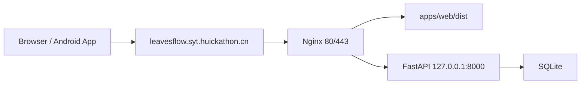

# LeavesFlow Android 封装与部署技术路线

版本日期：2026-05-17

适用分支：`v1`

适用范围：V1.3 Web/API 基线上的 Android debug 包与单机同域部署

文档状态：已按当前实现落地，可作为后续维护、重建环境和继续产品化的基线说明。

## 1. 当前交付结论

LeavesFlow 第一阶段移动端采用 **Capacitor 封装现有 React Web 应用**，先交付 Android debug APK，不在本阶段实现 iOS。

当前已经完成：

- Android 工程已接入仓库，应用名为 `leavesflow`。
- 包名为 `cn.huickathon.syt.leavesflow`。
- App 图标使用仓库根目录 `app_loge_demo.png` 生成。
- 原有 React Web 应用继续作为唯一业务 UI，不另起 React Native 界面层。
- 原生 Android 包访问线上 API：`https://leavesflow.syt.huickathon.cn/api/v1`。
- Web 生产环境访问同域 API：`/api/v1`。
- 线上部署采用同一台服务器、同一域名：
  - 前端静态文件由 Nginx 提供。
  - `/api/v1` 由 Nginx 反向代理到 FastAPI。
  - 域名启用 HTTPS。
- Android debug APK 已可构建。

## 2. 为什么选择 Capacitor

本阶段在“尽快形成可安装手机端产品，同时保留现有 Web 迭代效率”的目标下，优先选择 Capacitor，而不是直接转 React Native。

理由：

1. 现有 Web 端已经具备完整产品闭环，Capacitor 可以最大限度复用当前 React/Vite 代码，避免重新实现注册、路径、打卡、历史回放等整套界面。
2. 当前产品的核心交互以表单、任务路径、卡片和文本信息为主，不依赖复杂原生渲染能力，WebView 容器足以承载第一版移动端体验。
3. Capacitor 保留了后续接入原生能力的空间，例如文件、通知、分享、深链、外部链接桥接等，不会把后续路线堵死。
4. React Native 仍然是未来可选项，但它更适合在需要更重的原生交互、离线能力、复杂系统集成或极致性能时再引入；当前阶段直接迁移会带来较高重复开发成本。

结论：

- **V1 首选 Capacitor。**
- **iOS 暂缓。**
- **当产品已经验证、并出现明确原生体验瓶颈时，再评估 React Native 或更深层原生重构。**

## 3. 当前代码结构

### 3.1 关键文件

```text
capacitor.config.ts
apps/web/src/api.ts
package.json
android/
scripts/generate_android_icons.ps1
app_loge_demo.png
```

### 3.2 Capacitor 配置

`capacitor.config.ts`：

```ts
const config: CapacitorConfig = {
  appId: 'cn.huickathon.syt.leavesflow',
  appName: 'leavesflow',
  webDir: 'apps/web/dist',
  bundledWebRuntime: false,
  server: {
    androidScheme: 'https',
  },
}
```

说明：

- `webDir` 直接指向现有 Web 构建产物。
- `androidScheme: 'https'` 让 Android WebView 使用 HTTPS scheme。
- 当前未启用额外 Capacitor 插件，业务层仍以 Web 实现为主。

### 3.3 API 路由策略

`apps/web/src/api.ts` 当前按运行环境区分 API 地址：

```ts
const devBaseUrl = 'http://127.0.0.1:8000/api/v1'
const productionBaseUrl = '/api/v1'
const nativeBaseUrl = 'https://leavesflow.syt.huickathon.cn/api/v1'
```

行为：

- 本地 Web 开发：`http://127.0.0.1:8000/api/v1`
- 线上 Web：`/api/v1`
- Android 原生包：`https://leavesflow.syt.huickathon.cn/api/v1`

这样可以同时满足：

- 开发期前后端分离。
- 线上 Web 与 API 同域。
- 原生包在设备内不依赖 `localhost`。

注意：

- Android WebView 页面来源通常是 `https://localhost`。
- 后端 CORS 必须放行 `https://localhost`。
- 为兼容不同 Capacitor scheme，也保留放行 `capacitor://localhost`。
- 如果缺少这些来源，真机 APK 登录/注册会报 `Failed to fetch`，预检请求会返回 `Disallowed CORS origin`。

### 3.4 Android 基线

当前 Android 工程版本：

```text
minSdkVersion     24
compileSdkVersion 36
targetSdkVersion  36
```

应用显示名称与包名定义在：

```text
android/app/src/main/res/values/strings.xml
```

Manifest 当前只声明了网络权限：

```xml
<uses-permission android:name="android.permission.INTERNET" />
```

## 4. 构建命令

### 4.1 Windows 本机构建

```powershell
npm run build:android
```

该命令执行：

1. `npm run build:web`
2. `npx cap sync android`
3. `gradlew.bat assembleDebug`

### 4.2 Linux / 服务器构建

```bash
npm run build:android:linux
```

该命令执行：

1. `npm run build:web`
2. `npx cap sync android`
3. `./gradlew assembleDebug`

### 4.3 构建产物

```text
android/app/build/outputs/apk/debug/app-debug.apk
```

本地交付副本可以放在：

```text
artifacts/leavesflow-debug.apk
```

`artifacts/` 已加入 `.gitignore`，APK 产物不进入仓库。

## 5. 构建环境要求

### 5.1 Node.js

Capacitor 8 CLI 要求：

```text
Node.js >= 22
```

踩坑记录：

- Debian 12 默认源安装出的 Node 18 可以构建 Web，但执行 `npx cap` 会直接失败。
- 服务器构建 Android 前，必须先升级到 Node 22。

### 5.2 Java

当前 Android/Capacitor 依赖需要：

```text
JDK 21
```

踩坑记录：

- JDK 17 构建会失败，典型报错为：

```text
error: invalid source release: 21
```

### 5.3 Android SDK

至少需要：

```text
platform-tools
platforms;android-36
build-tools;36.0.0
```

首次构建过程中，Gradle 还可能自动补装它依赖的 `build-tools;35.0.0`。

Linux 构建时需要：

```text
ANDROID_HOME=/opt/leavesflow/android-sdk
ANDROID_SDK_ROOT=/opt/leavesflow/android-sdk
```

并确保：

```text
android/local.properties
```

包含：

```properties
sdk.dir=/opt/leavesflow/android-sdk
```

### 5.4 其他构建注意事项

- 从 zip 解包到 Linux 后，`android/gradlew` 可能没有可执行权限，需要：

```bash
chmod +x android/gradlew
```

- 当前仓库提供了：

```text
android/gradle-mirrors.init.gradle
```

用于优先走镜像仓库，降低 Gradle 依赖下载失败概率。

## 6. 图标与品牌资源

当前要求：

- App 名称固定为 `leavesflow`。
- `app_loge_demo.png` 仅作为 App 图标使用，不作为站点 logo。

当前脚本：

```text
scripts/generate_android_icons.ps1
```

用途：

- 基于 `app_loge_demo.png` 生成各密度 launcher icon。
- 保持 Android 工程资源目录一致。

后续如果要正式上架：

- 应补充自适应图标审查。
- 应准备 release 签名图标与商店素材。
- 应统一命名中 `loge` 的历史拼写问题，但不要在没有需求时随意改动已有引用。

## 7. 线上部署拓扑

### 7.1 单机同域方案



### 7.2 目录约定

服务器当前采用：

```text
/opt/leavesflow/app        应用代码与前端构建产物
/opt/leavesflow/venv       Python 虚拟环境
/opt/leavesflow/android-sdk Android SDK
/opt/leavesflow/jdk        JDK 21
```

### 7.3 FastAPI 服务

Systemd 服务名称：

```text
leavesflow-api.service
```

核心配置：

```ini
[Service]
WorkingDirectory=/opt/leavesflow/app
Environment=LEAVESFLOW_CONFIG_PATH=/opt/leavesflow/app/config/config.json
ExecStart=/opt/leavesflow/venv/bin/uvicorn leavesflow_api.main:app --host 127.0.0.1 --port 8000
Restart=always
```

### 7.4 Nginx 规则

核心策略：

- `/` 提供 `apps/web/dist`
- `/api/v1/` 反代 `127.0.0.1:8000/api/v1/`
- SPA 使用 `try_files $uri $uri/ /index.html`

### 7.5 CORS 规则

生产配置中的 `cors.allow_origins` 至少应包含：

```json
[
  "http://localhost:5173",
  "http://127.0.0.1:5173",
  "https://leavesflow.syt.huickathon.cn",
  "https://localhost",
  "capacitor://localhost"
]
```

### 7.6 HTTPS

当前线上已通过 Certbot 启用 HTTPS，证书域名：

```text
leavesflow.syt.huickathon.cn
```

证书自动续期已由 Certbot 配置。

## 8. 数据与配置策略

### 8.1 当前生产数据策略

当前首次部署使用本地现有 SQLite 数据库快照：

```text
services/api/data/leavesflow.db
```

这是用户已明确确认的阶段性方案。

### 8.2 配置策略

生产 API 使用：

```text
config/config.json
```

通过环境变量传入：

```text
LEAVESFLOW_CONFIG_PATH=/opt/leavesflow/app/config/config.json
```

### 8.3 敏感信息约束

以下内容不得提交到仓库：

```text
config/config.json
services/api/data/
*.db
artifacts/
.deploy/
```

说明：

- 数据库和真实 API key 只应保留在部署环境或本地私有文件。
- 对外文档不记录服务器密码、真实密钥、数据库内容。

## 9. 当前已验证事项

已完成验证：

- `npm run typecheck`
- `npm run build:web`
- `npx cap sync android`
- Linux 服务器端 Gradle debug 构建
- 线上首页 HTTPS 访问
- 线上 API 健康检查
- 本地已取得 debug APK

线上健康检查：

```text
https://leavesflow.syt.huickathon.cn/api/v1/health
```

期望返回：

```json
{"status":"ok"}
```

## 10. 当前限制

当前移动端交付仍属于第一阶段封装，不代表完整移动端产品化已经结束。

暂未完成：

- iOS 工程。
- Android release 签名包。
- 应用商店上架材料。
- 推送通知、离线能力、文件访问、分享等原生能力。
- 专门的移动端埋点与崩溃监控。
- release 构建流水线。
- 线上数据库备份与迁移自动化。
- Docker / IaC / 自动化部署流水线。

## 11. 后续建议顺序

1. 先完成真实设备手动测试：
   - 安装 debug APK。
   - 注册、登录、生成路径、打卡、历史回放。
   - 验证网络切换、冷启动、重复登录和返回前台。
2. 增加 release 构建路线：
   - keystore。
   - 签名配置。
   - 版本号策略。
3. 补齐部署工程化：
   - 数据库备份。
   - 一键更新脚本。
   - 环境变量与 secrets 管理。
4. 再评估 iOS：
   - 如果仍以 Web UI 为主，可继续沿用 Capacitor。
   - 如果出现原生体验瓶颈，再评估 React Native 或原生重构。

## 12. 2026-05-28 注册修复后的 APK 构建记录

本次注册修复已完成：

- 生产 API 已更新并重启。
- 线上 Web 已更新到新的构建产物。
- 生产接口随机用户名注册验证通过，并已删除测试账号。
- Android WebView 来源 `https://localhost` 的注册接口 CORS 预检仍返回 200。

APK 重新构建记录：

```text
本地 Windows：Gradle 可下载，但本机未配置 Android SDK，缺少 android/local.properties 或 ANDROID_HOME。
服务器 Linux：Android SDK 已存在于 /opt/leavesflow/android-sdk。
服务器已新增独立 JDK 21：/opt/leavesflow/jdks/jdk-21。
使用 JAVA_HOME=/opt/leavesflow/jdks/jdk-21 运行 npm run build:android:linux，构建成功。
```

新版 debug APK 已覆盖到：

```text
服务器：/opt/leavesflow/app/artifacts/leavesflow-debug.apk
本地：artifacts/leavesflow-debug.apk
```

APK 校验：

```text
大小：4631227 bytes
SHA256：985e37e716bd166bbe797ae60bbe0c79b4ed3b97de08eea8584dde4fecbb1692
```

## 13. 一句话总结

当前 LeavesFlow 已经从单纯 Web 产品推进到“**同一套 React 业务代码 + Android 原生壳 + 单机同域线上部署**”的第一阶段可安装形态；这条路线优先保证交付速度、复用率和后续演进空间。
